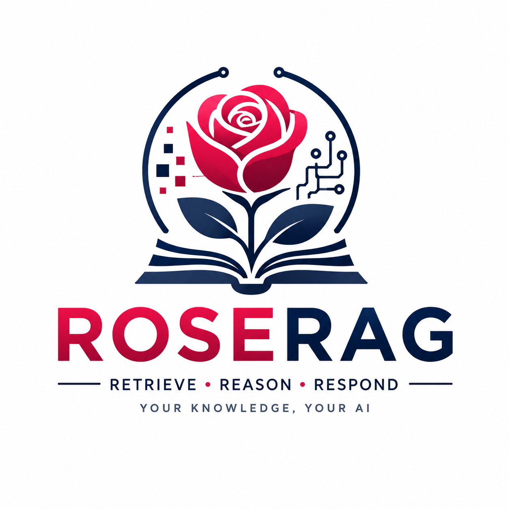

&#x20; 

<h1 align="center">ROSERAG</h1>

Retrieve • Reason • Respond

Academic-Grade Open Source Retrieval-Augmented Generation

Your Knowledge. Your AI.

\---

\## Vision

ROSERAG is an open-source academic retrieval-augmented generation platform that enables researchers, universities, libraries, and organizations to build trustworthy AI systems from curated knowledge sources.

\## Core Principles

\* Local-first

\* Open-source

\* Academic-grade retrieval

\* Ollama-powered

\* User-curated knowledge

\* Multi-interface architecture

\## Roadmap

\* \[x] FastAPI backend

\* \[x] Document API

\* \[ ] PDF ingestion

\* \[ ] Chunking engine

\* \[ ] Ollama embeddings

\* \[ ] Qdrant vector store

\* \[ ] Semantic search

\* \[ ] Academic Assistant UI

